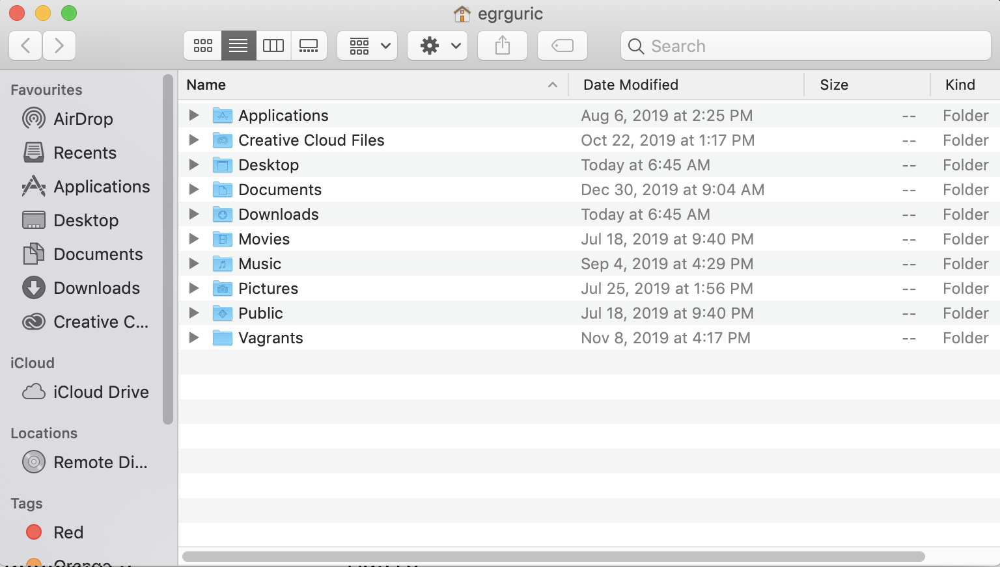

# Navigating the file system

Let's start by opening the Unix shell. There are a few things you are likely to see right away. A cursor that is flashing next to a $, a **prompt**, indicates where the command line begins. If you see the dollar sign it means that the command line is ready to take commands.

~~~
$
~~~

You are communicating with your computer by giving it commands and having it react to those commands.

## Orienting yourself

Let's enter our first command `pwd` which stands for **print working directory** and will tell us where we are in the system. The term "directory" refers to what you might visually think of as a "folder" when browsing your file system.

Input
{: .label .label-green}
~~~
$ pwd
~~~
Output
{: .label .label-yellow}
~~~
/Users/egrguric
~~~

We can use commands to open GUI for applications. For example, `open` opens finders on Mac. A dot, `.`, points to the current working directory. 

Input
{: .label .label-green}
~~~
$ open .
~~~

The command also works on native Linux systems and opens the default file manager. However, it does not work on WSL, as you do not have access to an extra graphical user interface. 

In a Unix filesystem, the **root directory** is referred by a single slash character, `/`. Inside this directory, there are several important directories: `bin` contains built-in programs, `data` contains miscellaneous data, `Users` contains user data, and `tmp` contains temporary files that do not need to be stored long-term. 

You can find the same structure on WSL, however, the default directory structure is different on Windows and the root directory is `drive:\`. 

To see the content of the filesystem in the terminal, `ls` is used.

Input
{: .label .label-green}
~~~
$ ls
~~~
Output
{: .label .label-yellow}
~~~
Applications		Downloads		Pictures
Creative Cloud Files	Library			Public
Desktop			Movies			Vagrants
Documents		Music
~~~

We can tailor the output of commands by adding options and arguments. For example, `-l` option makes `ls` use a long listing format showing additional information such as the file size and the time of its last modification. 

Input
{: .label .label-green}
~~~
$ ls -l
~~~
Output
{: .label .label-yellow}
~~~
total 0
drwx------@   3 egrguric  staff     96  6 Aug 14:25 Applications
drwx------+   6 egrguric  staff    192 21 Jan 22:04 Desktop
drwx------+  20 egrguric  staff    640 30 Dec 09:04 Documents
drwx------+ 527 egrguric  staff  16864 21 Jan 21:46 Downloads
drwx------@  71 egrguric  staff   2272 17 Oct 12:58 Library
drwx------+   3 egrguric  staff     96 18 Jul  2019 Movies
drwx------+   4 egrguric  staff    128  4 Sep 16:29 Music
drwx------+   4 egrguric  staff    128 25 Jul 13:56 Pictures
drwxr-xr-x+   4 egrguric  staff    128 18 Jul  2019 Public
~~~

By adding `-h` option, the file size becomes human readable.

Input
{: .label .label-green}
~~~
$ ls -lh
~~~
Output
{: .label .label-yellow}
~~~
total 0
drwx------@   3 egrguric  staff    96B  6 Aug 14:25 Applications
drwx------+   6 egrguric  staff   192B 21 Jan 22:04 Desktop
drwx------+  20 egrguric  staff   640B 30 Dec 09:04 Documents
drwx------+ 527 egrguric  staff    16K 21 Jan 21:46 Downloads
drwx------@  71 egrguric  staff   2.2K 17 Oct 12:58 Library
drwx------+   3 egrguric  staff    96B 18 Jul  2019 Movies
drwx------+   4 egrguric  staff   128B  4 Sep 16:29 Music
drwx------+   4 egrguric  staff   128B 25 Jul 13:56 Pictures
drwxr-xr-x+   4 egrguric  staff   128B 18 Jul  2019 Public

~~~

## Permissions and ownership

The first field of information in the list above is the file type. A file is represented by a hyphen, `-`, and a directory is represented by the letter `d`. The rest of it shows the permission groups: owner, group, and others.

Unix offers three permission groups. The first three letters shows the permissions used by the assigned owner of the file or directory. Each group is called a permission set, and consists of read, write, and execute permissions, represented by `r`, `w`, and `x`, respectively. A dash symbol in place of a character in a permission set indicated that particular permission is denied. Linux assigns initial permissions automatically when a new file or directory is created. 

Every file is owned by a specific user (or UID) and a specific group (or GID). To change the user or group of a file, we can use `chown` command.

Input
{: .label .label-green}
~~~
$ chown user filename
$ chown user:group filename
~~~

The `chmod` command is used to alter the permission of a file. For example, to add execute permission for the owner of a file:

Input
{: .label .label-green}
~~~
$ chmod u+x filename
~~~

The command `chmod` does not work on WSL.

## Getting help

Every shell command, including `ls`, has lots of other options. There are two common ways to find out how to use a command and the options available for it. We can read the **manual** of a command with `man`:

Input
{: .label .label-green}
~~~
$ man ls
~~~
Output
{: .label .label-yellow}
~~~

LS(1)                     BSD General Commands Manual                    LS(1)

NAME
     ls -- list directory contents

SYNOPSIS
     ls [-ABCFGHLOPRSTUW@abcdefghiklmnopqrstuwx1] [file ...]

DESCRIPTION
     For each operand that names a file of a type other than directory, ls
     displays its name as well as any requested, associated information.  For
     each operand that names a file of type directory, ls displays the names
     of files contained within that directory, as well as any requested, asso-
     ciated information.

     If no operands are given, the contents of the current directory are dis-
     played.  If more than one operand is given, non-directory operands are
     displayed first; directory and non-directory operands are sorted sepa-
     rately and in lexicographical order.

     The following options are available:

:
~~~
Notice the colon `:` which indicates that there is more text and you can keep paging through it by hitting "enter". To quit the manual hit the `q` key which stands for **quit**.

We can also pass `--help` option to the command:

Input
{: .label .label-green}
~~~
$ ls --help
~~~

`man` is a command by itself, which is a pager program that reads manuals of commands. `--help` is a built-in option for your command and not all commands implement it. `info` command is another helpful command that is more structured. The commands might show different output depending on the manual and information documents. You can also find the manual pages on the web. 

To clean the terminal for your next command, you should type `clear`.

## Moving around

To move between directories we can use the `cd` command which stands for **change directory**. It should be followed by a directory name to change the working directory. To move to the `Desktop` directory:

Input
{: .label .label-green}
~~~
$ cd Desktop
$ pwd
~~~
Output
{: .label .label-yellow}
~~~
/Users/egrguric/Desktop
~~~

When typing a directory name, the case of the directory doesn't matter on Mac or PC but does on Linux.

To move backwards in a directory, use `cd ..` which takes you back one step or `cd -` which moves you back to the previous directory and prints the directory (in the same way pwd would). 

Input
{: .label .label-green}
~~~
$ cd -
~~~
Output
{: .label .label-yellow}
~~~
/Users/egrguric
~~~

## Superuser

Short for **superuser do**, `sudo` is one of the most popular basic Linux commands that lets you perform tasks that require administrative or root permissions. When using sudo, the system will prompt users to authenticate themselves with a password. You might need to use sudo to install application on the system or access critical files. You should be careful when running commands with superuser access. 

`apt-get` is a command line tool for handling Advanced Package Tool (APT) libraries in Linux. It lets you retrieve information and bundles from authenticated sources to manage, update, remove, and install software and its dependencies. Running the `apt-get` command requires you to use sudo privileges. You can use `sudo apt-get update` and `sudo apt-get upgrade` to synchronize package files from sources and install upgrades.

