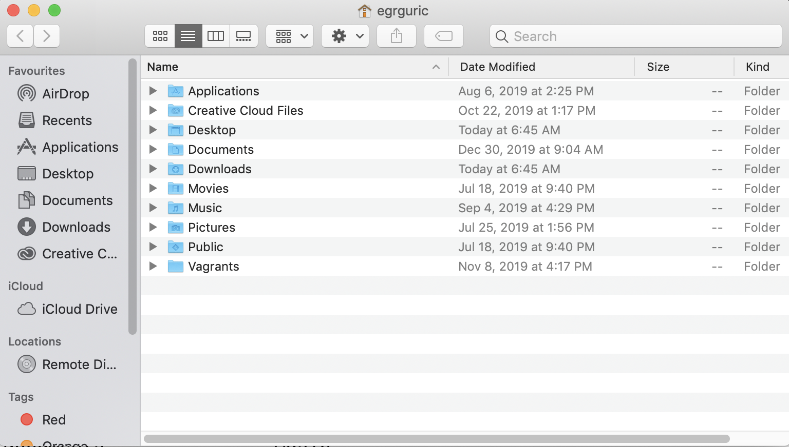

# Navigating the file system

Let's start by opening the Unix shell. Mac and Linux users will open the "Terminal" program on their computers. Windows users will open either "WSL" or "Windows Terminal", depending on what they chose to install.

There are a few things you are likely to see right away. A cursor that is flashing next to a `$` (or `%` in Zsh) indicates where the command line begins. This is called a **prompt**. If you see the dollar sign it means that the command line is ready to take commands.

~~~
$
~~~

You are communicating with your computer by giving it commands and having it react to those commands.

## Orienting yourself

Let's enter our first command, `pwd`, which stands for **print working directory** and will tell us where we are in the system. The term "directory" refers to what you might visually think of as a "folder" when browsing your file system.

Input
{: .label .label-green}
~~~
pwd
~~~
Output
{: .label .label-yellow}
~~~
/Users/egrguric
~~~

We can use commands to open graphical applications. For example, `open` opens Finder on Mac. A dot, `.`, points to the current working directory.

Input
{: .label .label-green}
~~~
open .
~~~

The command also works on native Linux systems and opens the default file manager. However, it does not work on WSL, as you do not have access to an extra graphical user interface.

In a Unix filesystem, the **root directory** is represented by a single slash character, `/`. Inside this directory, there are several important directories: `bin` contains built-in programs, `data` contains miscellaneous data, `Users` contains user data, and `tmp` contains temporary files that do not need to be stored long-term.

You can find the same structure on WSL. However, the default directory structure is different on Windows, and the root directory is `drive:\`.

To see the contents of the filesystem in the terminal, use `ls`.

Input
{: .label .label-green}
~~~
ls
~~~
Output
{: .label .label-yellow}
~~~
Applications		Downloads		Pictures
Creative Cloud Files	Library			Public
Desktop			Movies			Vagrants
Documents		Music
~~~

- To clean the terminal for your next command, you should type `clear`.

- If the directory name or filename is too long to type, you can type the first few letters to distinguish the path and use the Tab key to autocomplete directory and file names quickly.

We can tailor the output of commands by adding options and arguments. For example, the `-l` option makes `ls` use a long listing format, showing additional information such as file size and the time of last modification.

Input
{: .label .label-green}
~~~
ls -l
~~~
Output
{: .label .label-yellow}
~~~
total 0
drwx------@   3 egrguric  staff     96  6 Aug 14:25 Applications
drwx------+   6 egrguric  staff    192 21 Jan 22:04 Desktop
drwx------+  20 egrguric  staff    640 30 Dec 09:04 Documents
drwx------+ 527 egrguric  staff  16864 21 Jan 21:46 Downloads
drwx------@  71 egrguric  staff   2272 17 Oct 12:58 Library
drwx------+   3 egrguric  staff     96 18 Jul  2019 Movies
drwx------+   4 egrguric  staff    128  4 Sep 16:29 Music
drwx------+   4 egrguric  staff    128 25 Jul 13:56 Pictures
drwxr-xr-x+   4 egrguric  staff    128 18 Jul  2019 Public
~~~

By adding the `-lh` option, the file size becomes human-readable.

Input
{: .label .label-green}
~~~
ls -lh
~~~
Output
{: .label .label-yellow}
~~~
total 0
drwx------@   3 egrguric  staff    96B  6 Aug 14:25 Applications
drwx------+   6 egrguric  staff   192B 21 Jan 22:04 Desktop
drwx------+  20 egrguric  staff   640B 30 Dec 09:04 Documents
drwx------+ 527 egrguric  staff    16K 21 Jan 21:46 Downloads
drwx------@  71 egrguric  staff   2.2K 17 Oct 12:58 Library
drwx------+   3 egrguric  staff    96B 18 Jul  2019 Movies
drwx------+   4 egrguric  staff   128B  4 Sep 16:29 Music
drwx------+   4 egrguric  staff   128B 25 Jul 13:56 Pictures
drwxr-xr-x+   4 egrguric  staff   128B 18 Jul  2019 Public

~~~

## Permissions and ownership

The first field of information in the list above is the file type. A file is represented by a hyphen, `-`, and a directory is represented by the letter `d`. In the examples above, we have only directories and no files. The rest of the field shows the permission groups: owner, group, and others.

Unix uses three permission groups to manage access rights for files and directories. Each group of three letters represents a permission set comprising read (`r`), write (`w`), and execute (`x`) permissions. The initial three letters in the permission set indicate the permissions granted to the file or directory owner. The second set determines the access rights granted to users who belong to the group associated with the file or directory. The last set represents the permissions for others or everyone else.

If a dash symbol appears in place of a character within a permission set, it signifies that the specific permission is denied. When creating a new file or directory, Linux automatically assigns initial permissions based on predefined rules.

Every file is owned by a specific user (or UID) and a specific group (or GID).
 
## Getting help

Every shell command, including `ls`, has many other options. There are several ways to find out how to use a command and the options available for it. 

- `man` is a command itself: a pager program that reads command manuals. `man` pages are also accessible on the web.
- `--help` is a built-in option for some commands, but not all commands implement it (e.g., `ls`). When you run a command followed by `--help`, it typically displays a concise help message that describes the command's basic usage and provides information on available command-line options.
- The `info` command is another source of documentation, often found in GNU software. It provides more extensive and structured documentation compared to the `man` pages.

The two most common ways are `man` and the `--help` option.

We can read the **manual** for a command with `man`:

Input
{: .label .label-green}
~~~
man ls
~~~
Output
{: .label .label-yellow}
~~~

LS(1)                     BSD General Commands Manual                    LS(1)

NAME
     ls -- list directory contents

SYNOPSIS
     ls [-ABCFGHLOPRSTUW@abcdefghiklmnopqrstuwx1] [file ...]

DESCRIPTION
     For each operand that names a file of a type other than directory, ls
     displays its name as well as any requested, associated information.  For
     each operand that names a file of type directory, ls displays the names
     of files contained within that directory, as well as any requested, asso-
     ciated information.

     If no operands are given, the contents of the current directory are dis-
     played.  If more than one operand is given, non-directory operands are
     displayed first; directory and non-directory operands are sorted sepa-
     rately and in lexicographical order.

     The following options are available:

:
~~~
Notice the colon `:`, which indicates that there is more text and that you can keep paging through it by hitting Enter. To quit the manual, hit the `q` key, which stands for **quit**.

We can also pass the `--help` option to the command:

Input
{: .label .label-green}
~~~
curl --help
~~~

## Moving around

To move between directories, we can use the `cd` command, which stands for **change directory**. It should be followed by a directory name to change the working directory. To move to the `Desktop` directory:

Input
{: .label .label-green}
~~~
cd Desktop
pwd
~~~
Output
{: .label .label-yellow}
~~~
/Users/egrguric/Desktop
~~~

When typing a directory name, capitalization usually doesn't matter on Mac or Windows, but it does on Linux.

To move backwards in a directory, use `cd ..`, which takes you back one step, or `cd -`, which moves you back to the previous directory and prints the directory (in the same way `pwd` would).

Input
{: .label .label-green}
~~~
cd -
~~~
Output
{: .label .label-yellow}
~~~
/Users/egrguric
~~~

## Superuser

`sudo` is a widely used command in Linux, short for **superuser do**. It allows users to execute tasks that require administrative or root permissions. When you use `sudo`, the system prompts you to authenticate yourself with a password. This command is typically used to perform actions, like installing applications or accessing critical files, that require elevated privileges. You should be careful when running commands with superuser access to avoid unintended consequences.

`apt-get` is a command line tool for handling Advanced Package Tool (APT) libraries in Linux. It enables you to manage software packages, including retrieving information, updating, installing, and removing software and its dependencies. Running `apt-get` commands necessitates the use of `sudo` privileges.  You can use `sudo apt-get update` and `sudo apt-get upgrade` to synchronize package files from sources and install upgrades.

