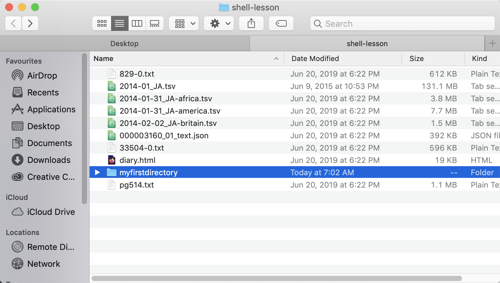

# Working with files and directories

Now that you know how to move around in the system we can try making changes to it.

First, let's navigate to our working folder.

Input
{: .label .label-green}
~~~
$ cd Desktop
$ cd shell-lesson
$ pwd
~~~
Output
{: .label .label-yellow}
~~~
/Users/egrguric/desktop/shell-lesson
~~~

Note that you can jump directly to a directory you already know is there by just entering the full path.

~~~
$ cd Desktop/shell-lesson
~~~

And you can use "tab" to autocomplete directory and file names quickly.

From this point on we will be working in the shell-lesson folder.

## Creating a directory
Let's try creating a directory and moving in and out of it.

Input
{: .label .label-green}
~~~
$ mkdir myfirstdirectory
$ cd myfirstdirectory
$ ls
~~~

Output
{: .label .label-yellow}
~~~
000003160_01_text.json		33504-0.txt
2014-01-31_JA-africa.tsv	829-0.txt
2014-01-31_JA-america.tsv	diary.html
2014-01_JA.tsv			myfirstdirectory
2014-02-02_JA-britain.tsv	pg514.txt
~~~

You can see there is now a new directory in the same location. If we try going into it we will see that it's empty.

There is also a handy way to see this change visually.
~~~
$ open .
~~~

Output
{: .label .label-yellow}

# Creating a file
Now let's create a file. There are built-in text editors accessible through the shell. Nano is a commonly used editor.

Input
{: .label .label-green}
~~~
$ touch myfile
$ nano myfile
$ ls
~~~
Output
{: .label .label-yellow}
~~~
000003160_01_text.json		829-0.txt
2014-01-31_JA-africa.tsv	diary.html
2014-01-31_JA-america.tsv	myfile
2014-01_JA.tsv			myfirstdirectory
2014-02-02_JA-britain.tsv	pg514.txt
33504-0.txt
~~~

## Moving, copying, and deleting files and directories

Input
{: .label .label-green}
~~~
$ mv myfile myfirstdirectory/myfile
$ cd myfirstdirectory
$ ls
~~~
Output
{: .label .label-yellow}
~~~
myfile
~~~

The mv function also renames files.

Input
{: .label .label-green}
~~~
$ mv myfile mynewfile
$ ls
~~~
Output
{: .label .label-yellow}
~~~
mynewfile
~~~

The "cp" command lets you copy files, for example if you want to create a backup.

Input
{: .label .label-green}
~~~
$ cp mynewfile backup_mynewfile
~~~

And you can delete files through the "rm" command which stands for remove.

Input
{: .label .label-green}
~~~
$ rm backup_mynewfile
ls
~~~
Output
{: .label .label-yellow}
~~~
mynewfile
~~~

You can also delete directories but that requires an additional (and dangerous) flag. -r stands for "recursive" which essentially tells the command "rm" to keep going through all of the files that are inside the directory as well until there's nothing left.

Input
{: .label .label-green}
~~~
$ cd ..
$ ls
$ rm -r myfirstdirectory
$ ls
~~~
Output
{: .label .label-yellow}
~~~
000003160_01_text.json		33504-0.txt
2014-01-31_JA-africa.tsv	829-0.txt
2014-01-31_JA-america.tsv	diary.html
2014-01_JA.tsv			pg514.txt
2014-02-02_JA-britain.tsv
~~~

## Reading files

Let's take a look at the files that are in the shell-lesson folder.

Sometimes you want to get a more in-depth sense of what is in the files in a directory.

We've already talked a bit about looking at the information about the file.

Input
{: .label .label-green}
~~~
$ ls -lh
~~~

Output
{: .label .label-yellow}
~~~
total 286664
-rwxr-xr-x@ 1 egrguric  staff   383K 20 Jun  2019 000003160_01_text.json
-rwxr-xr-x@ 1 egrguric  staff   3.6M 20 Jun  2019 2014-01-31_JA-africa.tsv
-rwxr-xr-x@ 1 egrguric  staff   7.4M 20 Jun  2019 2014-01-31_JA-america.tsv
-rwxr-xr-x@ 1 egrguric  staff   125M  9 Jun  2015 2014-01_JA.tsv
-rwxr-xr-x@ 1 egrguric  staff   1.4M 20 Jun  2019 2014-02-02_JA-britain.tsv
-rwxr-xr-x@ 1 egrguric  staff   582K 20 Jun  2019 33504-0.txt
-rwxr-xr-x@ 1 egrguric  staff   598K 20 Jun  2019 829-0.txt
-rwxr-xr-x@ 1 egrguric  staff    18K 20 Jun  2019 diary.html
-rwxr-xr-x@ 1 egrguric  staff   1.0M 20 Jun  2019 pg514.txt
~~~

But you can also quickly open the entirety of the file from the command line.

Input
{: .label .label-green}
~~~
$ cat 829-0.txt
~~~

The command "cat" gives you everything in a file all at once which is great when working with smaller files but can be overwhelming with larger files. Sometimes all you want to see is a small subset of a file.

Another option similar to "cat" is "less" which similar to the manual shows you only what fits in your terminal window and then lets you move through the content by hitting enter.

Input
{: .label .label-green}
~~~
$ less
~~~

The command "head" defaults to showing the first ten lines in a file.

Input
{: .label .label-green}
~~~
$ head
~~~

Output
{: .label .label-yellow}
~~~
The Project Gutenberg eBook, Gulliver's Travels, by Jonathan Swift

This eBook is for the use of anyone anywhere at no cost and with
almost no restrictions whatsoever.  You may copy it, give it away or
re-use it under the terms of the Project Gutenberg License included
with this eBook or online at www.gutenberg.org

Title: Gulliver's Travels
       into several remote nations of the world

Author: Jonathan Swift

Release Date: June 15, 2009  [eBook #829]

Language: English
829-0.txt
~~~

You can ask head to show more or less as needed.

"Tail" works similarly

Input
{: .label .label-green}
~~~
$ tail 829-0.txt
~~~

Output
{: .label .label-yellow}
~~~
Most people start at our Web site which has the main PG search facility:

     http://www.gutenberg.org

This Web site includes information about Project Gutenberg-tm,
including how to make donations to the Project Gutenberg Literary
Archive Foundation, how to help produce our new eBooks, and how to
subscribe to our email newsletter to hear about new eBooks.

~~~
Up arrow in a black command to reuse commands.

You can use this method to quickly view all of a type of file in a directory.

Input
{: .label .label-green}
~~~
$ head *.txt
~~~

Output
{: .label .label-yellow}
~~~
==> 829-0.txt <==
The Project Gutenberg eBook, Gulliver's Travels, by Jonathan Swift

This eBook is for the use of anyone anywhere at no cost and with
almost no restrictions whatsoever.  You may copy it, give it away or
re-use it under the terms of the Project Gutenberg License included
with this eBook or online at www.gutenberg.org

==> pg514.txt <==
The Project Gutenberg EBook of Little Women, by Louisa May Alcott

This eBook is for the use of anyone anywhere at no cost and with
almost no restrictions whatsoever.  You may copy it, give it away or
re-use it under the terms of the Project Gutenberg License included
with this eBook or online at www.gutenberg.net

Title: Little Women
~~~

Input
{: .label .label-green}
~~~
$ head -n1 *.txt
~~~

Output
{: .label .label-yellow}
~~~
==> 33504-0.txt <==
The Project Gutenberg EBook of Opticks, by Isaac Newton

==> 829-0.txt <==
The Project Gutenberg eBook, Gulliver's Travels, by Jonathan Swift

==> pg514.txt <==
The Project Gutenberg EBook of Little Women, by Louisa May Alcott
~~~
