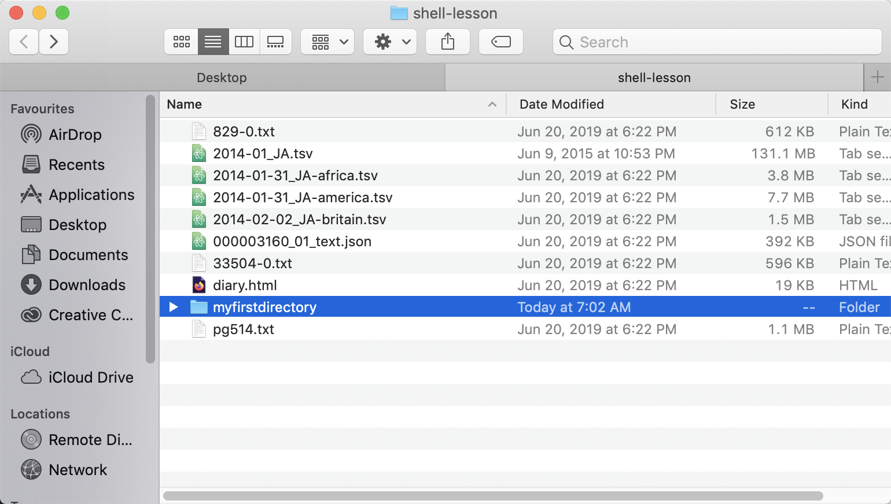

# Working with files and directories

Now that you know how to move around in the system we can try making changes to it.

First, let's navigate to our Desktop.

Input
{: .label .label-green}
~~~
$ cd Desktop
$ pwd
~~~
Output
{: .label .label-yellow}
~~~
/Users/egrguric/desktop
~~~

If a directory of filename is too long to type you can use "tab" to autocomplete directory and file names quickly.

## Creating a directory
Let's try creating a directory and moving in and out of it.

Input
{: .label .label-green}
~~~
$ mkdir myfirstdirectory
$ ls
~~~

You can see there is now a new directory in the same location. If we try going into it we will see that it's empty.

There is also a handy way to see this change visually.
~~~
$ open .
~~~

Output
{: .label .label-yellow}

# Creating a file
Now let's create a file. There are built-in text editors accessible through the shell. These editors are handy if you need to make a quick change from the shell or want to avoid having to open another program while you are working in it. Nano is a commonly used text editor.

Input
{: .label .label-green}
~~~
$ touch myfile.txt
$ nano myfile.txt
$ ls
~~~
Output
{: .label .label-yellow}
~~~
myfile
myfirstdirectory
~~~

## Moving, copying, and deleting files and directories

Now let's try moving our new file into our new directory to organize things a bit.

Input
{: .label .label-green}
~~~
$ mv myfile myfirstdirectory/myfile.txt
$ cd myfirstdirectory
$ ls
~~~
Output
{: .label .label-yellow}
~~~
myfile.txt
~~~

The mv function also renames files.

Input
{: .label .label-green}
~~~
$ mv myfile.txt mynewfile.txt
$ ls
~~~
Output
{: .label .label-yellow}
~~~
mynewfile
~~~

The "cp" command lets you copy files, for example if you want to create a backup.

Input
{: .label .label-green}
~~~
$ cp mynewfile.txt backup_mynewfile.txt
~~~

And you can delete files through the "rm" command which stands for remove.

Input
{: .label .label-green}
~~~
$ rm backup_mynewfile.txt
ls
~~~
Output
{: .label .label-yellow}
~~~
mynewfile.txt
~~~

You can also delete directories but that requires an additional (and dangerous) flag. -r stands for "recursive" which essentially tells the command "rm" to keep going through all of the files that are inside the directory as well until there's nothing left.

Input
{: .label .label-green}
~~~
$ cd ..
$ ls
$ rm -r myfirstdirectory
$ ls
~~~
Output
{: .label .label-yellow}
~~~

~~~

## Reading files

Let's make a few files to work with for the next activity.

Sometimes you want to get a more in-depth sense of what is in the files in a directory.

We've already talked a bit about looking at the information about the files.

Input
{: .label .label-green}
~~~
$ touch file1.txt file2.txt file3.txt file4.txt
~~~
Output
{: .label .label-yellow}
~~~
file1.txt
file2.txt
file3.txt
file4.txt
~~~

Input
{: .label .label-green}
~~~
$ ls -lh
~~~

But you can also quickly open the entirety of the file from the command line.

Input
{: .label .label-green}
~~~
$ cat file1.txt
~~~

Output
{: .label .label-yellow}
~~~

~~~

Input
{: .label .label-green}
~~~
$ nano file1.txt
~~~

Output
{: .label .label-yellow}
~~~
My super secret plan.

Part 1

Part 2

Part 3

Part 4

Part 5
~~~

Input
{: .label .label-green}
~~~
$ head
~~~

Output
{: .label .label-yellow}
~~~
My super secret plan.

Step 1

Step 2

Step 3

Step 4

~~~

You can ask head to show more or less as needed.

"Tail" works similarly

Input
{: .label .label-green}
~~~
$ tail file1.txt
~~~

Output
{: .label .label-yellow}
~~~

Step 3

Step 4

Step 5

Step 6

World domination!
~~~

Input
{: .label .label-green}
~~~
$ less
~~~

Output
{: .label .label-yellow}
~~~
My super secret plan.

Step 1

Step 2

Step 3

Step 4

Step 5
:
~~~

Use the enter key to move through the file and "q" to "quit" or exit the file.

The command "head" defaults to showing the first ten lines in a file.

You can use this method to quickly view all of a type of file in a directory.

Input
{: .label .label-green}
~~~
$ head *.txt
~~~

Or only the first line of all of the files which might be useful if there are a lot of them. 

Input
{: .label .label-green}
~~~
$ head -n1 *.txt
~~~
